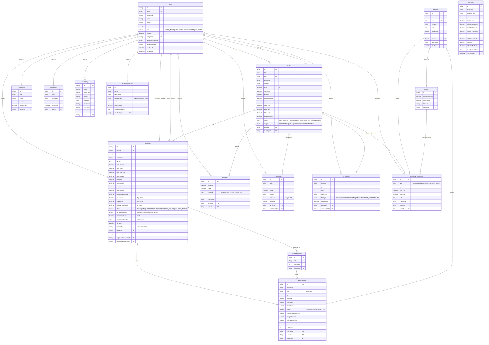
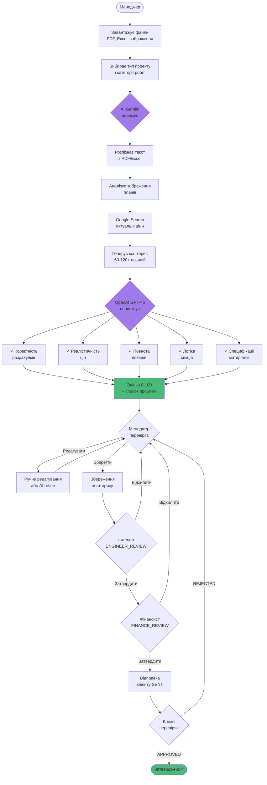
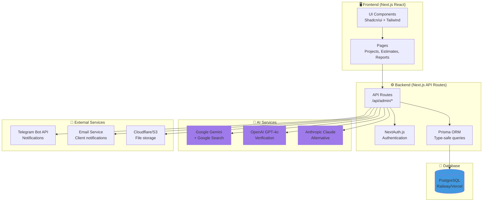
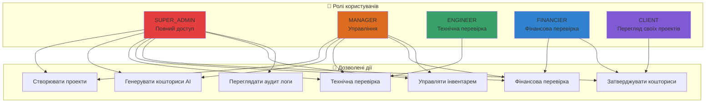
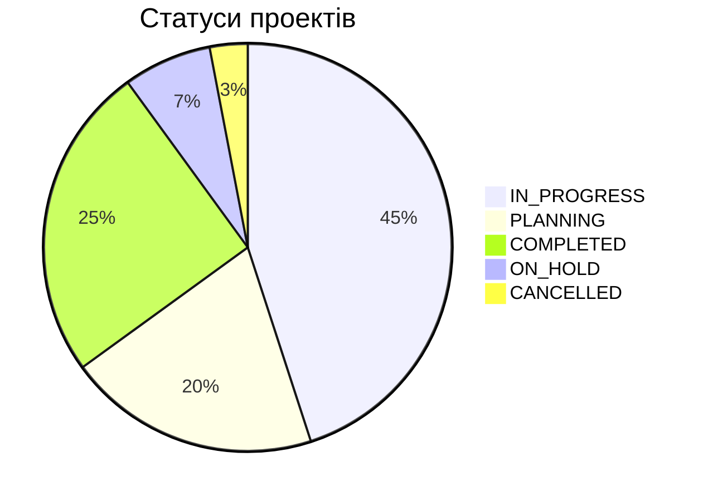
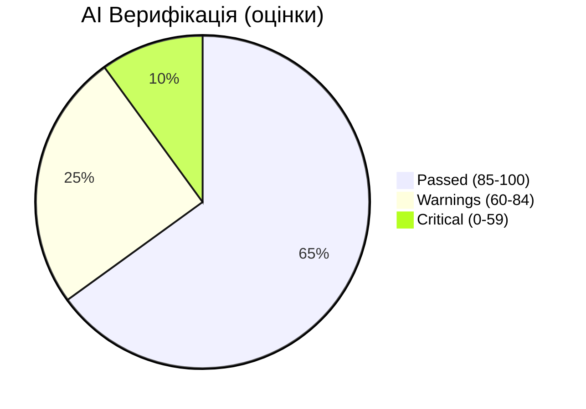

# Бізнес-модель Metrum Group - Візуалізація

## ERD Діаграма (Entity Relationship Diagram)

---

## Бізнес-процес: AI Генерація Кошторису

---

## Архітектура системи

---

## Матриця доступу

---

## Ключові метрики

---

## Використання

**GitHub:** Ці діаграми автоматично рендеряться в README.md

**Інші платформи:**
- Скопіюйте Mermaid код
- Вставте на mermaid.live для рендерингу
- Експортуйте як PNG/SVG

**Онлайн редактори:**
- https://mermaid.live
- https://mermaid-js.github.io/mermaid-live-editor

**VSCode:**
- Встановіть розширення "Markdown Preview Mermaid Support"
- Відкрийте preview (Cmd+Shift+V)
